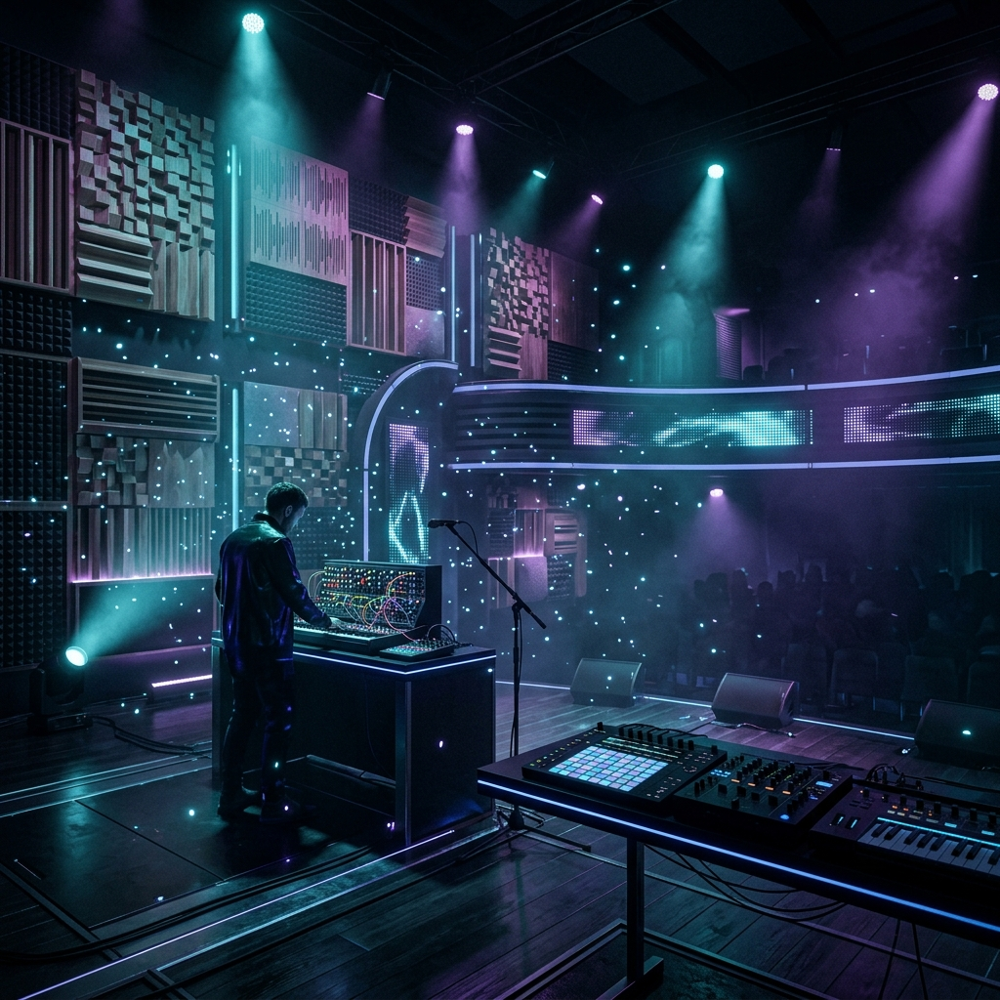
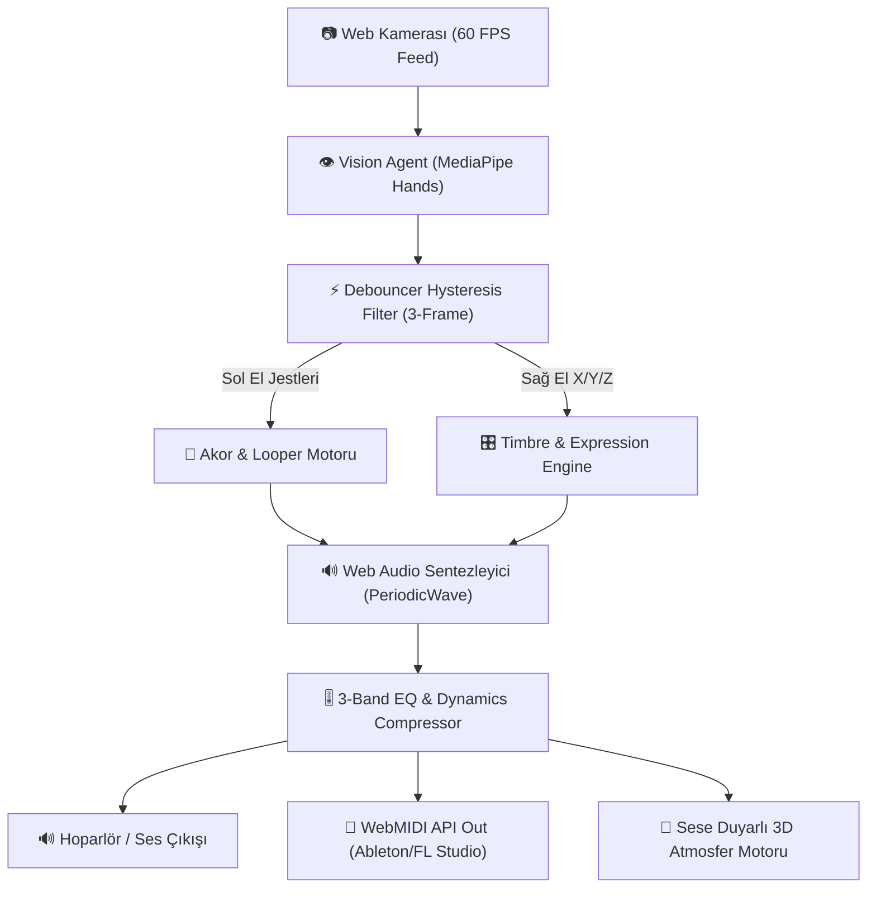

# 🎻 AuraSynth Pro VST3 Ultimate - Real-time Gestural Synthesizer & Audio-Reactive World Engine



> **AuraSynth Pro VST3**, bilgisayarınızın kamerasını kullanarak **iki elinizin hareketlerini (Dual Hand Tracking)** gerçek zamanlı takip eden, sol el jestleriyle **akorları ve döngü kayıtlarını (Looper)**, sağ el jestleriyle ise **filtrenin perdesini (Cutoff), 3D Derinliğini (Reverb Depth), Vibratoyu ve Paning** değerlerini dinamik yöneten yeni nesil bir **Sanal Donanım Enstrümanı (VST3)** ve **Sese Duyarlı 3D Atmosfer Motorudur**.

---

## 🌟 Ana Özellikler & Stüdyo Mimarisi

### 🔌 1. WebMIDI DAW Çıkış Desteği (External DAW Router)
* Sol ve sağ el hareketlerinizi anlık olarak **MIDI Mesajlarına (Note On/Off, CC#74 Cutoff, CC#10 Pan, CC#91 Reverb ve Pitch Bend)** dönüştürür.
* **Ableton Live, FL Studio, Logic Pro, Serum veya Kontakt** gibi profesyonel DAW yazılımlarına sanal MIDI klavyesi gibi bağlanır.

### 🔁 2. Dahili 4-Kanal Canlı Looper Station (`⏺ REC`, `▶ PLAY`, `🗑 CLEAR`)
* Performans esnasında sol elinizle çaldığınız akor dizilimini (örneğin 4 ölçülük akor yürüyüşünü) zaman uyumlu olarak kaydeder ve döngüye alır.
* Arka planda akor döngüsü çalarken ellerinizle üstüne canlı keman soloları veya arpejler atmanıza olanak tanır.

### 🌌 3. Sese & Jestlere Duyarlı Canlı Atmosfer Motoru (Audio-Reactive World)
* **4 Dinamik Mekan Teması**:
  * 🌌 **Cyberpunk Stage**: Neon cyan ve mor frekans patlamaları.
  * 🎻 **Symphony Hall**: Sıcak amber/altın senfoni işık pırıltıları.
  * 🪐 **Deep Cosmos Nebula**: Derin uzay ve yıldız hızı bükülmesi.
  * ⚡ **High-Voltage Plasma Matrix**: Yüksek voltajlı plazma arkları.
* Sol elinizin her akor değişiminde ekrana ve arka plana halka şeklinde şok dalgaları (shockwave pulses) yayılır.

### 🧊 4. 3D Z-Aks Derinlik Modülasyonu (Hand Camera Proximity)
* MediaPipe'ın Z-aksını kullanarak elinizin kameraya olan yakınlığını algılar.
* Elinizi kameraya yaklaştırdığınızda Yankı/Reverb Derinliğini ve 3D Genişliğini büyütür, uzaklaştırdığınızda merkeze odaklar.

### 🎛️ 5. Master Dynamics Kompresör & 3-Band Parametrik EQ
* **Dynamics Compressor**: $-18\text{dB}$ eşik değeri ve $8:1$ oranı ile çoklu akor ve ses çalımlarında frekans çakışmalarını ve sesteki patlamaları (clipping/distortion) engeller.
* **3-Band EQ**: Bass (100 Hz), Mid (1 kHz) ve Treble (8 kHz) stüdyo tonlama kontrolü.

### 🎙️ 6. Canlı WAV Ses Kayıtçısı & Senkronize Metronom
* **WAV Audio Exporter**: Performansınızı tarayıcı üzerinden stüdyo kalitesinde ses dosyası (`.wav`) olarak kaydeder ve bilgisayarınıza indirir.
* **BPM Metronom**: Arpeggiator ve Looper ile tam senkronize ritim kontrolü.

---

## 🖐️ Jest & El Haritası Tablosu

| El | Konum / Jest | İşlev & Müzikal Parametre | MIDI Karşılığı |
| :--- | :--- | :--- | :--- |
| **Sol El** | 1 Parmak Açık | Solo Lead / Root Nota | MIDI Note On (Solo) |
| **Sol El** | 2 Parmak Açık | Majör Triad Akoru (Root-Maj3-P5) | MIDI Chord Triad |
| **Sol El** | 3 Parmak Açık | Minör Triad Akoru (Root-Min3-P5) | MIDI Chord Triad |
| **Sol El** | 4 Parmak Açık | 7'li Caz/Pop Akoru (7th) | MIDI 7th Chord |
| **Sol El** | 5 Parmak Açık | Zengin Ambient Pad (9th) | MIDI 9th Chord |
| **Sol El** | Yumruk (Kapalı) | Sesi Tamamen Sustur (Mute) | MIDI Note Off |
| **Sağ El** | Dikey Konum (Y-Aksı) | Filter Cutoff Frekansı (150Hz - 12kHz) | MIDI CC #74 |
| **Sağ El** | Yatay Konum (X-Aksı) | Stereo Panning (Sol $\leftrightarrow$ Sağ) | MIDI CC #10 |
| **Sağ El** | Derinlik (Z-Aksı) | 3D Reverb Odası ve Oda Genişliği | 3D Delay Mod |
| **Sağ El** | Hızlı Titretme (Wiggle) | Gerçek Canlı Keman Vibratosu | Pitch Bend |
| **Sağ El** | Cımbız (Pinch) Hareketi | Reverb Yankı Miktarı | MIDI CC #91 |

---

## 🏗️ Sistem Mimari Şeması



---

## 🚀 Kurulum ve Çalıştırma

### 1. Tarayıcı Üzerinden Çalıştırma (Tavsiye Edilen)
Proje dizininde yerel bir HTTP sunucusu başlatın:

```bash
python -m http.server 8080
```

Ardından tarayıcınızdan **`http://localhost:8080`** adresine gidin ve **"AUDIO MOTORUNU BAŞLAT"** butonuna tıklayın.

### 2. Standalone Python Sürümünü Çalıştırma
Gerekli bağımlılıkları yükleyin:

```bash
pip install opencv-python mediapipe sounddevice numpy
```

Uygulamayı başlatın:

```bash
python gesture_synth.py
```

---

## 📄 Lisans
AuraSynth Pro VST3 Ultimate Architecture &copy; 2026 • MIT License.
